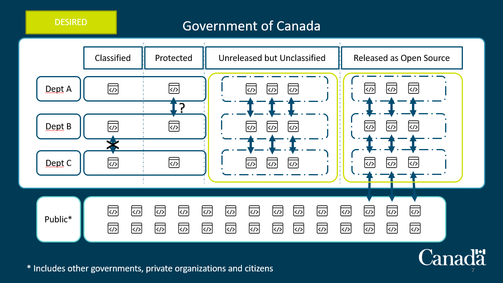

# Government of Canada Source Code Platform

## Objective

Analyse options for a Government of Canada source code version control system.

## High Level Business Requirements

* Provide hosting options for Government of Canada software
  * GC developed/contracted open source code
  * GC developed/contracted unreleased source code
    * GC source code at the 'PROTECTED' level
    * GC source code at the classified (C/S/TS/++) levels

### Discoverability and Collaboration of projects

|Source Code|Team|Department|Whole GC|Public|
|---|---|---|---|---|
|Open Source|X|X|X|X|
|Unreleased but unclassified|X|X|X||
|Protected|X|X|||
|Classified|X||||

## Functional and Non-Functional Requirements

* The solution must be accessible to all departments and agencies of the GC
  * The non-private repos/projects must be accessible and discoverable by any department or agency.
* Identity and Access Management integrated to all departments
* The platform must able to be used as the primary source code repository for all departments and agencies
* APIs and Hooks must be provided to:
  * Support departments specific SDLC environments (IDEs, OS, Network, etc.) and methodologies (traditional waterfall, DevSecOps, etc.)
  * Support departments specific CI/CD needs, e.g.:
    * Seamless and automated governance and policy implementation
    * Code repository scanning for known vulnerabilities, licence compliance, audits, reporting, etc.    
    * Automation/Orchestration: Build, Unit test, Deploy, Prod, etc.
* Needs 24/7, 365 days support

## Options Analysis

From an architecture standpoint, there are multiple options.

* On premise (self-managed), open source
* On premise (managed), open source
* On premise (self-hosted), proprietary
* Software as a Service (cloud), open source **
* Software as a Service (cloud), proprietary
* Managed instance on Platform as a Service, open source

** Even if the SaaS is open source, the hosted nature of the instance means that the exit strategy may be as complex and costly as with a proprietary solution. Need to consider managed instance running on PaaS option.

All options must support use of additional tools and services configurations:

* CI testing
* Package/Dependency Management
  * Known security vulnerabilities
  * Licence compliance
  * Audits
  * Notices
* Governance and policies automated enforcement
  * Exception management

## Known Technology Options

* On premise (self-managed), open source
  * CVS
  * Fossil
  * Git
  * GitLab
  * Mercurial
  * Phabricator
  * SVN
* On premise (managed), open source
* On premise (self-hosted), proprietary
  * Atlasian BitBucket
  * GitHub Enterprise
  * IBM ClearCase
  * Microsoft Azure DevOps Server
  * Perforce
* Software as a Service (cloud), open source **
  * FramGit.org
  * GitLab.com
* Software as a Service (cloud), proprietary
  * Assembla
  * Azure Repos
  * BitBucket.org
  * GitHub.com
  * sourceforge.net
* Managed instance on Platform as a Service, open source
  * Azure Repos
  * GitLab.com